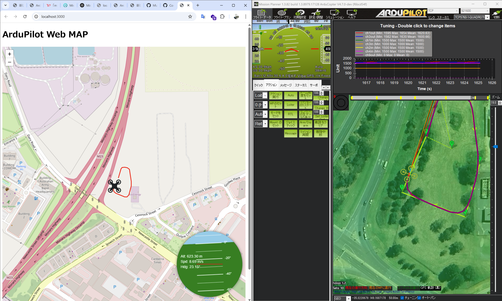

# web-drone-map
This is a simple web application that displays the position and HUD of an ArduPilot drone in a browser.   
To evaluate the feasibility of implementation in different languages, the server-side functionality is implemented in both Python and JavaScript.

## Setup

```
pip install flask flask-socketio pymavlink mavproxy
```

or

```
npm install express socket.io node-mavlink
```

## Run

1. Run simulator  
   Download Mission Planner and run the SITL simulator. See this link for details.  
   [https://ardupilot.org/planner/docs/mission-planner-simulation.html](https://ardupilot.org/planner/docs/mission-planner-simulation.html)
2. Forward telemetry
    ```
    mavproxy.py --master=tcp:127.0.0.1:5762 --out=udp:127.0.0.1:14551
    ```
   

1. Start server
    ```
    python server.py
    ```

    or

    ```
    node server.js
    ```

3. Open client  
    Open [http://localhost:3000/](http://localhost:3000/) in web browser
    